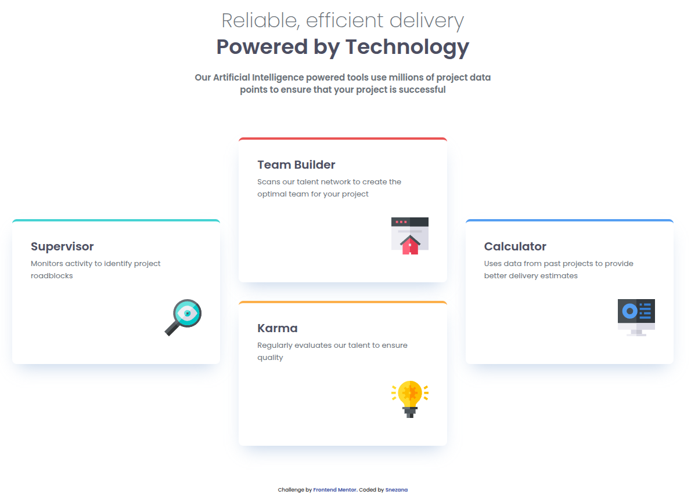

# Frontend Mentor - Four card feature section solution

This is a solution to the [Four card feature section challenge on Frontend Mentor](https://www.frontendmentor.io/challenges/four-card-feature-section-weK1eFYK). Frontend Mentor challenges help you improve your coding skills by building realistic projects.

## Table of contents

- [Overview](#overview)
  - [The challenge](#the-challenge)
  - [Screenshot](#screenshot)
  - [Links](#links)
- [My process](#my-process)
  - [Built with](#built-with)
  - [What I learned](#what-i-learned)
  - [AI Collaboration](#ai-collaboration)

## Overview

### The challenge

Users should be able to:

- View the optimal layout for the site depending on their device's screen size

### Screenshot



### Links

- Solution URL: [GitHub Repository](https://github.com/gsnezana7/four-card-feature-vue-scss)
- Live Site URL: [Live Demo on Netlify](https://four-card-feature-vue-scss.netlify.app/)

## My process

### Built with

- Semantic HTML5 markup
- CSS Grid (using `grid-template-areas` for the stepped layout)
- SCSS (BEM methodology, mixins, and variables)
- Mobile-first workflow
- [Vue.js 3](https://vuejs.org) - Progressive JS Framework
- [Vite](https://vitejs.dev) - Build tool

### What I learned

In this project, I strengthened my CSS Grid skills by implementing a non-standard 3-column layout. I also focused on accessibility (A11y) by separating `:hover` behavior for mouse users and `:focus-visible` for keyboard navigation.

I'm proud of this Grid area implementation:

```scss
.features-grid {
  display: grid;
  gap: 2rem;
  @media (min-width: 64rem) {
    grid-template-columns: repeat(3, 1fr);
    grid-template-rows: repeat(2, 1fr);
    grid-template-areas:
      "supervisor builder calc"
      "supervisor karma   calc";
  }
}
```

### AI Collaboration

When studying Grid, scss, vue, I turned to AI (Google Gemini) for help.
